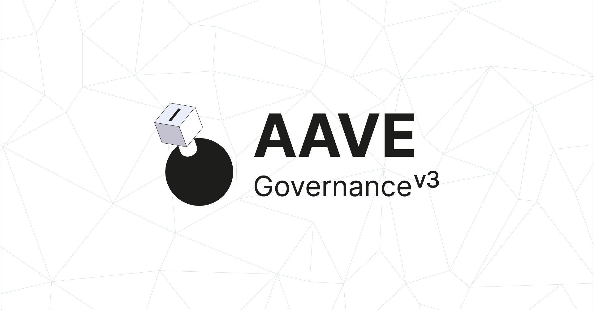

# Aave Governance V3 frontend



<br>

React application to interact with the Aave Governance V3 smart contracts: visualize data and build blockchain transactions.

## Built on

- Logic: [React](https://react.dev/),  [Next.js](https://nextjs.org/), [zustand](https://docs.pmnd.rs/zustand/getting-started/introduction).
- Web3: [viem](https://viem.sh/), [wagmi](https://wagmi.sh/), [@bgd-labs/frontend-web3-utils](https://github.com/bgd-labs/fe-shared).
- Styling: [MUI system](https://mui.com/system/getting-started/), [headlessui](https://headlessui.com/).
- Server: [tRPC](https://trpc.io/), [Rest API](https://api.onaave.com/docs)

## Pre-requirements

- [Node.js](https://nodejs.org/ru): version 18 or higher.
- [Git](https://git-scm.com/downloads): version 2.3.x or higher.
- Package manager: we recommend [Pnpm](https://yarnpkg.com/), version 9.x or higher.

## Configurations
- Blockchain RPC URLs can be changed here [file](./src/helpers/chain/getInitialRpcUrls.ts) and IPFS gateway URLs can be changed here [file](./src/configs/configs.ts).
- It is possible to run the application in SSR (Server-Side-Rendering) or IPFS mode, by changing `NEXT_PUBLIC_DEPLOY_FOR_IPFS`. The default is `false`, which is the most optimal option for all use cases.

<br>

## How to access the Aave Governance v3 UI?

### Run locally
```sh
pnpm install && pnpm dev
// or
pnpm install && pnpm build && pnpm start
```

### Deploy your own Vercel instance

You can deploy your version of the application using Vercel just by clicking on the following button, and following the instructions:

[](https://vercel.com/new/clone?repository-url=https%3A%2F%2Fgithub.com%2Fbgd-labs%2Faave-governance-v3-interface)

### Hosted version

We have our own hosted version from Vercel, you can access it on [https://vote.onaave.com/](https://vote.onaave.com/)

<br>

## For developers
### 1. How to add new chain support to the application?
1.1. Need to update `RPCUrls` type. [file](./src/helpers/chain/getInitialRpcUrls.ts) `// TIP: The new chain rpc name should be here`

1.2. Need to add public RPC urls for new chain. [file](./src/helpers/chain/getInitialRpcUrls.ts) `// TIP: The new chain public RPC urls should be here`

1.3. Need to set new chain with other chains. [file](./src/helpers/chain/getChains.ts) `// TIP: The new chain should initialize here`

1.4. Need to add new chain to server chains. [file](./src/requests/utils/chains.ts) `// TIP: The new private RPC url's for the server is specified here.`

1.5. Need to add new chain to client chains. Not necessarily, in very rare cases. [file](./src/configs/chains.ts) `// TIP: The new private RPC url's for the client is specified here (getting from client env).`

### 2. How to add new payloads controller support to the application?

2.1. First need to determine whether this will be added to a new chain or whether a new controller will be added to one of the existing chain.

2.2. Need to update `@bgd-labs/aave-address-book`.

2.3. If the controller is added to an existing chain:

2.3.1. Need to find the required chain in the application payload controller configuration. [file](./src/configs/appConfigInit.ts)

2.3.2. Need to leave the address of the payload controller from the address-book first, and insert the old address that was used earlier as the second element of the array. We leave the old address of the payload controller so that it would be possible to view the data on the payloads from the old controller in the UI. `TIP: Old payloads controller addresses will be added here in the array`

2.4. If the controller is added to a new chain:

2.4.1. Need to add support for the new chain to the application if it is not already done. How to add support for the new chain is described in the first point.

2.4.2. Need to add the address of the payloads controller and the payloads controller data helper to the application payload controller configuration. [file](./src/configs/appConfigInit.ts) `TIP: Addresses for the new chain with a payload controller are added here`

### 3. How to add new voting machine support to the application?

3.1. First need to determine whether this will be added to a new chain or whether a new voting machine will be added to one of the supported chains.

3.2. Need to update `@bgd-labs/aave-address-book`.

3.3. If a voting machine is added to a supported chain:

3.3.1. Need to add a voting portal address for a specific chain. [file](./src/configs/appConfigInit.ts) `// TIP: The address for the new chain with the voting portal has been added here`

3.3.2. Need to add a voting machine addresses for a specific chain. [file](./src/configs/appConfigInit.ts) `// TIP: The addresses for the new chain with the voting machine has been added here`

3.4. If a voting machine is added to a new chain:

3.4.1. Need to add support for the new chain to the application if it is not already done. How to add support for the new chain is described in the first point.

3.4.2. Follow the steps 3.3.1 and 3.3.2.

### 4. How to change gov core to testnet?

4.1. Simply, need to change the core name to sepolia. [file](./src/configs/appConfig.ts) `// TIP: Сan be changed to sepolia testnet`

## License

Copyright © 2023, Aave DAO, represented by its governance smart contracts.

Created by BGD Labs.

**IMPORTANT**. The BUSL1.1 license of this repository allows for any usage of the software, if respecting the *Additional Use Grant* limitations, forbidding any use case damaging anyhow the Aave DAO's interests.
